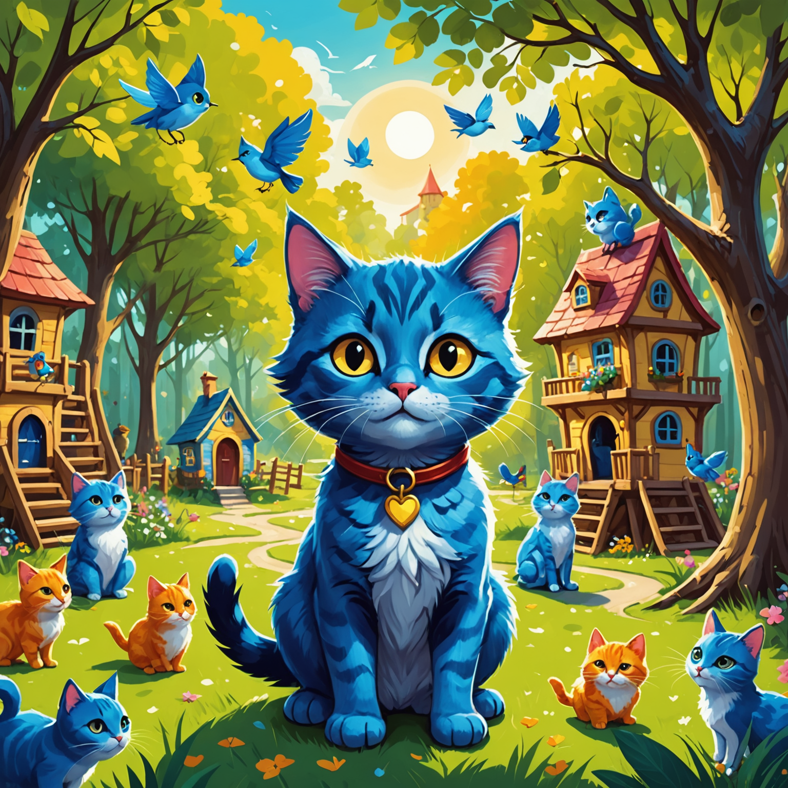
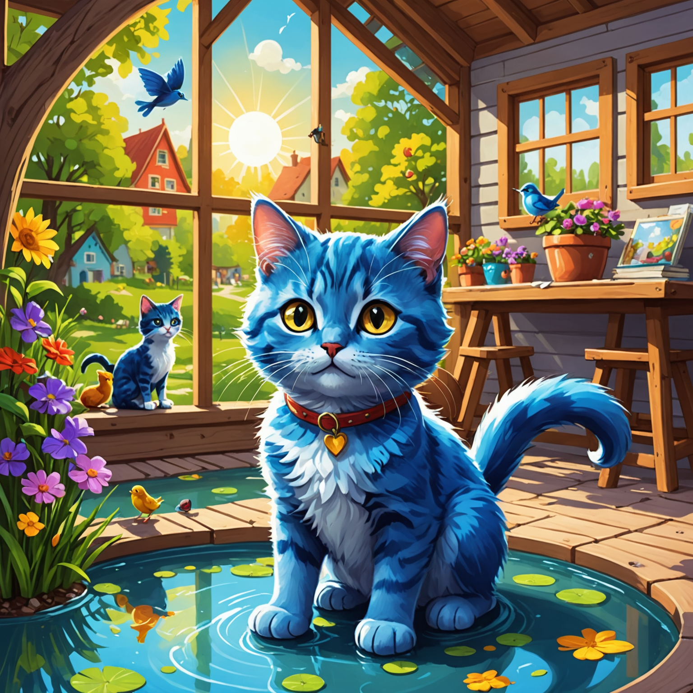
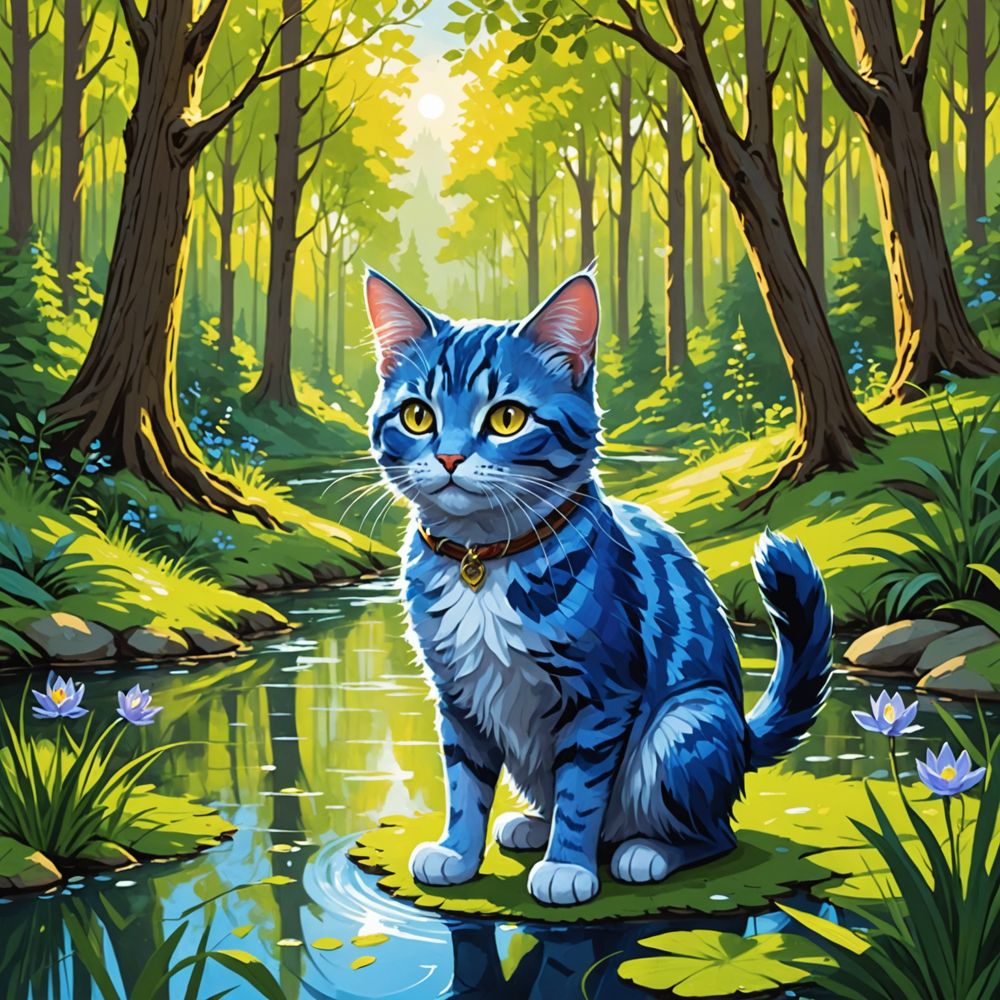
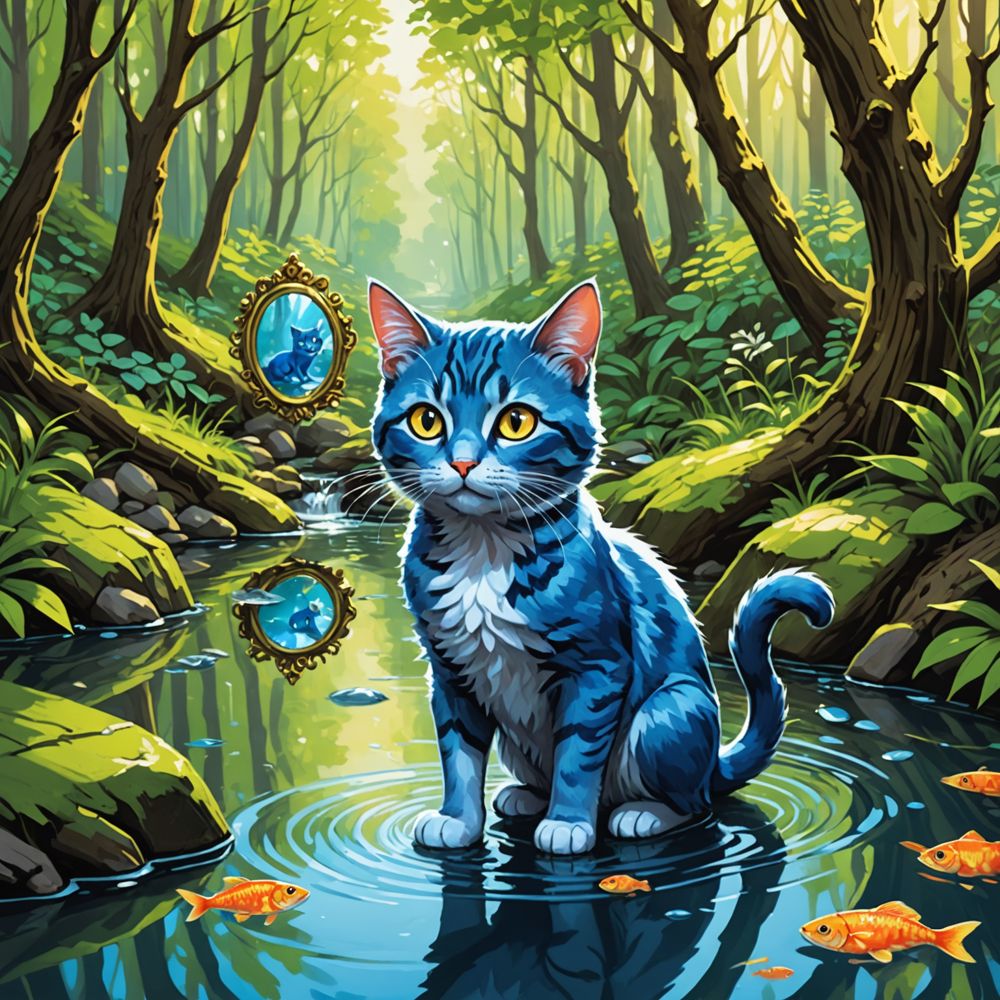

<p align="center">
  
</p>


# KITTY - Keep It Talk-safe To Youth

> **AI 기반 유해성 탐지, 자동 대체, 그리고 동화 생성까지**  
> 아이들이 안전하고 창의적인 디지털 경험을 누릴 수 있도록 돕는 통합 플랫폼입니다.


<br/>
<br/>
<br/>

## 📁 프로젝트 구조

```
kitty-ai/              # 유해 문장 감지 및 대체 시스템
kitty_ai_agent/        # 일기 및 이미지 생성 AI 에이전트 시스템
report_generator/      # 생성형 AI기반 통계/리포트 생성기 및 GPT 요약 보고서
```

<br/>
<br/>


## 🔧 주요 기능 요약

### 1. 🛡️ 유해 문장 탐지 및 정제 (kitty-ai)
- 사전 기반 + RoBERTa 모델 기반 다중 클래스 유해성 예측
- OpenAI GPT를 활용한 문장 대체 제안
- API 기반 필터링 서비스 제공

### 2. 📊 통계 기반 리포트 생성기 (report_generator)
- `chat_db.csv`, `site_db.csv` → 유해성 통계 분석
- 사용자별 top 3 유해 단어, 보냄/받음 비율 계산
- GPT를 통한 요약 보고서 Markdown 자동 생성

### 3. 📘 동화 및 이미지 생성 시스템 (kitty_ai_agent)
- `risk_score`에 따라 이야기 톤 조정 (Positive / Neutral / Challenge)
- 3회 반복 생성 → GPT로 평가 → 최적 결과 선택 (생성 → 평가 → 선택 → 학습 구조)
- 매일 이어지는 일기 + 아동용 이미지 생성

---

<br/>
<br/>


### 🏞️ 이어지는 이야기 흐름 (EXP 기반 자동 생성)

#### ✅ 첫번째 날



> **“오늘은 친구들과!”**  
> 이 이야기는 EXP가 높은 경우 (50 이상) 생성되는 **Positive 시나리오**입니다.  
> 햇살 아래 놀이터에서 새 친구들과 신나게 뛰노는 키티의 하루를 그립니다.

```bash
This morning, the blue cat Kitty was full of confidence thanks to yesterday's forest adventure. This time, she went to the playground with her neighborhood friends, the little birds. The playground was full of sunshine and brightly lit. Kitty felt happy as she swung high into the sky. Her friends praised her bravery and laughed together. 'Yesterday was exploring the forest, today I'm flying in the sky!' Kitty thought. As the day came to an end, Kitty cherished the time spent with her friends. 'Any day can be special when we're together!' Kitty promised to herself.
```

<br/>

---

#### ✅ 두번째 날



> **“어제는 친구들과, 오늘은 물 위에서 반짝반짝!”**  
> 매일 이어지는 일기 같은 이야기, 키티는 평온한 시간을 연못가에서 보냅니다.  
> 이 스토리는 중립적이고 따뜻한 **Neutral 시나리오**입니다.


```bash
Another bright morning arrived. The blue cat Kitty remembered the fun times at the pond yesterday and decided to take a walk to the nearby forest. The forest was cool, with gentle sunlight streaming through the trees. Kitty felt refreshed as she walked, looking at the green leaves. Suddenly, a small voice came from deep in the forest. 'Help!' It was a little mouse, stuck with its tiny foot caught in a tree root. Kitty quickly ran over to help the mouse. The mouse shyly smiled, grateful, and Kitty's heart filled with warmth. 'Today, I had a little adventure in the forest. I'm so glad I could help a friend!' Kitty thought as she smiled on her way home.
```


---

<br/>
<br/>


### 🔁 AI 피드백 반영 과정 (Loop 기반)

#### 📤 원래 이미지 → 🪄 피드백 이후 이미지

| Before | After |
|--------|-------|
|  |  |

> AI Agent는 생성된 이미지에 대해 자동 평가(Critic LLM)를 수행합니다.  
> 피드백: `"키티의 외형 특징과 스토리의 구성 요소를 더 명확히 반영하면 좋습니다."`  
> → 해당 피드백을 반영해 다음 루프에서 더 나은 결과를 생성합니다.  
> 이 과정은 Cost를 아끼기 위해, 최대 3회 반복되며 최종 결과만 저장됩니다.


---

## 🔧 함수/클래스 구조 요약

### 📦 report_generator

| 함수명 | 설명 |
|--------|------|
| `generate_chat_report()` | 채팅 로그 기반 유해 사용자 리포트 생성 |
| `generate_user_report()` | 사이트 활동 기반 GPT 요약 생성 |
| `append_row_to_chat_csv()` | 새 채팅 로그 추가 |
| `append_row_to_site_csv()` | 새 사이트 로그 추가 |
| `get_harmful_chat_categories_by_id()` | 채팅 ID 기반 평균 유해 점수 |
| `get_harmful_site_categories_by_id()` | 사이트 ID 기반 평균 유해 점수 |

---

### 📦 kitty-ai

| 함수명 / 클래스 | 설명 |
|----------------|------|
| `replace_text()` | 유해 문장을 GPT로 교정 |
| `TextPredictor` | 모델 기반 유해 문장 예측기 |
| `DictionaryChecker` | 사전 기반 유해어 탐지기 |
| `ChatDataManager` | 예측 결과 기록 및 저장 |
| `QuizGenerator` | 유해 표현 퀴즈 생성기 |

---

### 📦 kitty_ai_agent

| 함수 / 클래스 | 설명 |
|---------------|------|
| `AgentManager.run_agent(risk_score)` | 전체 생성 파이프라인 실행 |
| `planner_llm.call()` | 프롬프트 조정 및 톤 결정 |
| `story_llm.call()` | 영어/한글 동화 생성 |
| `story_critic_llm.call()` | 스토리 평가 및 피드백 생성 |
| `image_llm.call()` | Stable Diffusion 기반 이미지 생성 |
| `image_critic_llm.call()` | 이미지 품질 평가 |
| `prompt_critic_llm.call()` | 생성 프롬프트 리비전 수행 |

---


